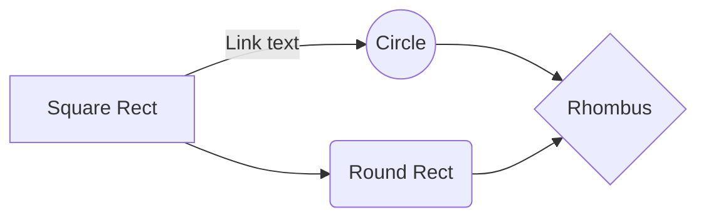

# java-learning

## Codigos de trabajo de PILARES basados en el programa de 'Programador Junior Java'.

|Archivo                        |Descripcion                  |
|-------------------------------|-----------------------------|
|`hello.java`         		    |Un programa "Hola Mundo".            |
|`variables.java`            |Codigo con Variables de Java.            |
|`operadores.java`|Codigo que utiliza operadores basicos de Java asi como el uso de inputs para operar dos valores ademas devuelve el valor en "segundos" una vez finalizado el programa mediante "System.currentTimeMIllis();".	|
|`sentencias.java`|Sentencias de Java: if, for, while...(escribiendo...)	 |

- Ruta:

## Extras.

- Otros codigos misceláneos:

	

|Archivo                        |Descripcion                  |
|-------------------------------|-----------------------------|
|`arrayToTxt.java`         		|Creacion y escritura de un documento de texto.txt usando un arreglo basico e imprimir una pequeña lista dentro del archivo.|